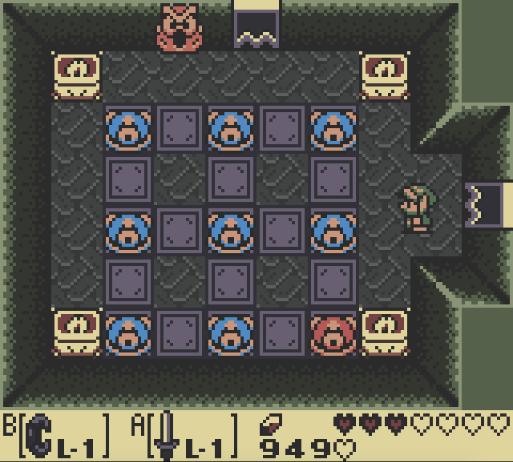
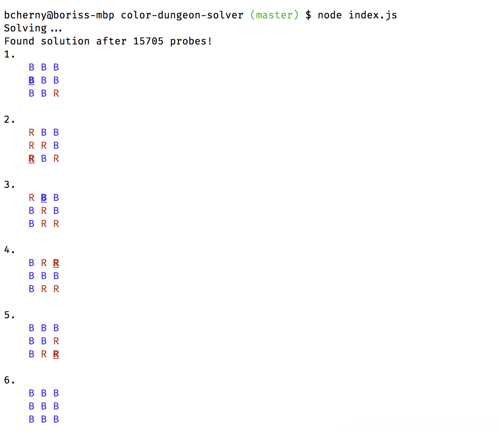

# Color-dungeon-solver [![npm]](https://www.npmjs.com/package/color-dungeon-solver) [![mit]](https://opensource.org/licenses/MIT)

> A solver for the [Color Dungeon Puzzle](https://strategywiki.org/wiki/The_Legend_of_Zelda:_Link%27s_Awakening/Color_Dungeon) in Zelda: Link's Awakening DX for Gameboy

[npm]: https://img.shields.io/npm/v/color-dungeon-solver.svg?style=flat-square
[mit]: https://img.shields.io/npm/l/color-dungeon-solver.svg?style=flat-square



## Installation

```sh
# Using Yarn:
yarn add color-dungeon-solver

# Or, using NPM:
npm install color-dungeon-solver
```

## Usage

```js
import { B, R, run } from 'color-dungeon-solver'

// B means Blue, R means Red
let input = [
  [B, B, B],
  [B, B, B],
  [B, B, R]
]

run(input).forEach((step, n) =>
  console.log(`${n + 1}.`, step.toDiffString())
)
```

This will give the following output:



## License

MIT
